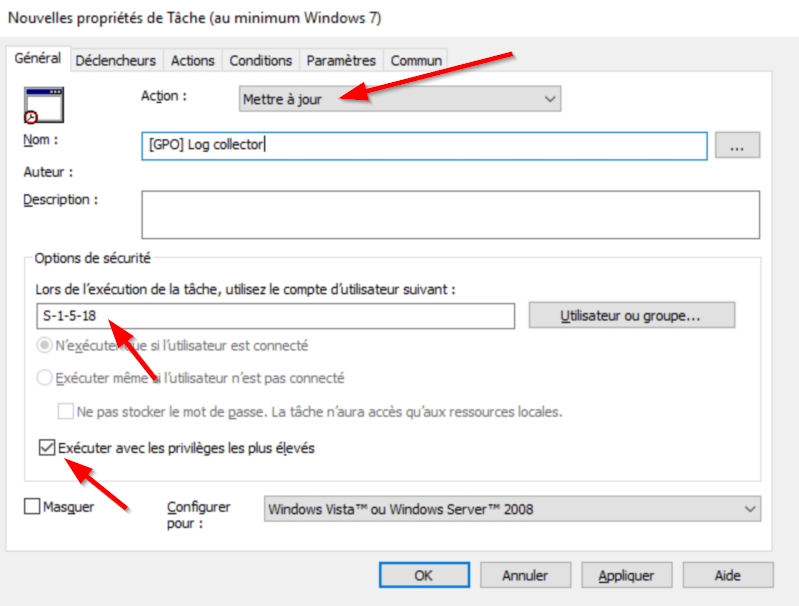
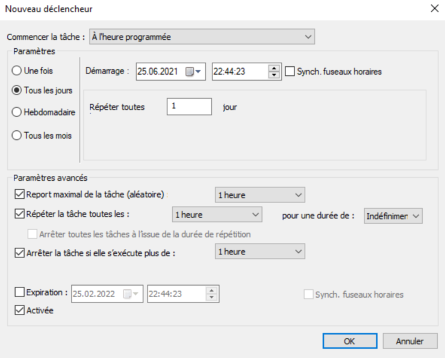
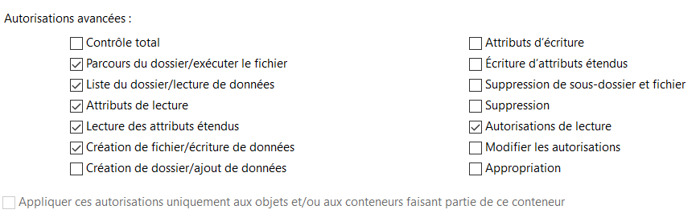

  <h3 align="center">ZeroTrust</h3>

  

    Two awesome scripts to deploy ZeroTrust in an internal Network without complexity
   

 

## About The Project

One of the best component to avoid lateral movement is the local firewall of each computer. I didn't find a tool that really suited my needs so I created this enhanced one. 
The idea is to use logs of the local firewall of each Windows and make firewall rules after 30 days of learning. 
To solve the problem, tow scripts are used:
* `ZT-ExportLogFWToCalculator.ps1` is used on all Windows to
  * push logs into a collector via SMB
  * apply rules generated by the collector
* `ZT-ComputingRules.ps1` is used on the collector to convert all logs into xml and ps& (rules)

## Prerequisites

* Windows server with a lot of space (~60GB for 1000 servers) for log storage

## Installation
### 1.Deploy log collector `ZT-ExportLogFWToCalculator.ps1`
1) Create a Scheduledtask via a GPO
* The task (_>= windows 7_) needs to run with the user `S-1-5-18` (System)

* The task needs to run every hour of every day for ever.

* The task needs to run `powershell -exec bypass -nop -File \\dom.lo\Sysvol\dom.lo\scripts\ZT-ExportLogFWToCalculator.ps1`

2) Save `ZT-ExportLogFWToCalculator.ps1` into `C:\Windows\SYSVOL\domain\scripts\ZT-ExportLogFWToCalculator.ps1`
* Set the following ACL on this file:
  * Remove `Authenticated users`
  * Add `Domain computers` with read only privilege

### 2.Configure the log collector
1) Create a **local** Scheduledtask
* The task (_>= windows 7_) needs to run with the user `S-1-5-18` (System)

* The task needs to run every hour of every day for ever.

* The task needs to run `powershell -exec bypass -nop -File C:\Scripts\ZT-ComputingRules.ps1`
  
2) Create shared folder named `log$`
* Set the following ACL on this file:
  * Remove `Authenticated users`
  * Add `Domain computers` with
	  * read privilege
	  * list folder
	  * create file
	  * read permission
 

