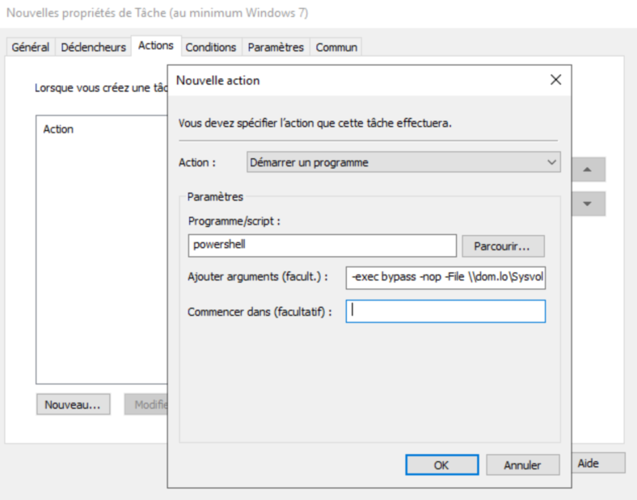

<div align="center">
  <h3 align="center">ZeroTrust</h3>

  <p align="center">
    Two awesome scripts to deploy ZeroTrust in an internal Network without complexity
   </p>
</div>
<br>


## About The Project

One of the best component to avoid lateral movement is the local firewall of each computer. I didn't find a tool that really suited my needs so I created this enhanced one.<br>
The idea is to use logs of the local firewall of each Windows and make firewall rules after 30 days of learning.<br>
To solve the problem, tow scripts are used:
* `ZT-ExportLogFWToCalculator.ps1` is used on all Windows to
  * push logs into a collector via SMB
  * apply rules generated by the collector
* `ZT-ComputingRules.ps1` is used on the collector to convert all logs into xml and ps1 (rules)


## Workflow

1) Scheduledtask `ZT-ExportLogFWToCalculator.ps1` : push logs into **collector**
2) Scheduledtask `ZT-ExportLogFWToCalculator.ps1` : check if PS1 with the name of the local machine account exist into the collector. If it exist, run it !
3) Scheduledtask `ZT-ComputingRules.ps1` : read all logs and create XML rules.
4) Scheduledtask `ZT-ComputingRules.ps1` : After the 30 days of learning, a ps1 script is generated for the target machine. Only the target machine can read the file. The script alters the firewall to allow only the flows that have been seen during the learning time.


## Prerequisites

* Windows server with a lot of space (~60GB for 1000 servers) for log storage
* Knowledge about IP ranges:
	* what are the IPs of the users on ethernet ? on wifi ? on VPN ?
	* what are the IPs of the admins ?
* Dedicated IP for admins. You can use a VPN like WireGuard, so administrators will need to mount the VPN before performing administrative tasks.


## Installation
### 1.Deploy log collector `ZT-ExportLogFWToCalculator.ps1`
1) Edit `ZT-ExportLogFWToCalculator.ps1` and change
```ps1
$REMOTE_database="$(pwd)\logs"
```
into
```ps1
$REMOTE_database="\\log-storage.your-domain.lo)\logs$"
```

2) Create a Scheduledtask via a GPO
* The task (_>= windows 7_) needs to run with the user `S-1-5-18` (System)

* The task needs to run every hour of every day for ever.

* The task needs to run `powershell -exec bypass -nop -File \\dom.lo\Sysvol\dom.lo\scripts\ZT-ExportLogFWToCalculator.ps1`


3) Save `ZT-ExportLogFWToCalculator.ps1` into `C:\Windows\SYSVOL\domain\scripts\ZT-ExportLogFWToCalculator.ps1`
* Set the following ACL on this file:
  * Remove `Authenticated users`
  * Add `Domain computers` with read only privilege
```ps1
$script='C:\Windows\SYSVOL\domain\scripts\ZT-ExportLogFWToCalculator.ps1'
$acl = Get-Acl $script
$usersid = New-Object System.Security.Principal.Ntaccount ('your-domain.lo\Authenticated Users')
$acl.PurgeAccessRules($usersid)
$acl | Set-Acl $script
$acl = Get-Acl $script
$fsar = New-Object System.Security.AccessControl.FileSystemAccessRule('your-domain.lo\Domain computers', 'ReadAndExecute', 'Allow')
$acl.SetAccessRule($fsar)
$acl | Set-Acl $script
```

### 2.Configure the log collector
1) Edit `ZT-ExportLogFWToCalculator.ps1` and change
```ps1
$DB_database      = "$(pwd)\data"
$DB_debugLogs     = "$(pwd)\logs"
$IP_ROLE = @{
	# List of admin IP allowed to administrate DC
	IP_ADMIN=@(
		'10.1.30.0/24',
		'10.250.250.1',
		'192.168.1.0-192.168.1.20'
	);
	IP_USERS=@(
		'10.1.2.0/24', # Ethernet
		'10.1.1.0/24', # Ethernet
		'10.1.4.0/24'  # Wifi
	);
	# IP in this block will be ignored, no rules will be created for them.
	# So if these IP make connection on a server, the remote server will not make a rule for them.
	LOOPBACK=@(
		'6.6.6.6'
	);
}
```
into
```ps1
$DB_database      = "C:\ZeroTrust\data"
$DB_debugLogs     = "C:\ZeroTrust\logs-activities"

# Change these IPs !!!!!!!
$IP_ROLE = @{
	# List of admin IP allowed to administrate DC
	IP_ADMIN=@(
		'10.1.30.0/24',
		'10.250.250.1',
		'192.168.1.0-192.168.1.20'
	);
	IP_USERS=@(
		'10.1.2.0/24', # Ethernet
		'10.1.1.0/24', # Ethernet
		'10.1.4.0/24'  # Wifi
	);
	# IP in this block will be ignored, no rules will be created for them.
	# So if these IP make connection on a server, the remote server will not make a rule for them.
	LOOPBACK=@(
		'6.6.6.6'
	);

	# You can make group here like:
	MY_GROUP=@(
		'1.2.3.4',
		'1.2.3.5'
	);
	MY_DATABASE=@(
		'4.5.6.7',
		'4.5.6.8'
	);
}
```

2) Create a **local** Scheduledtask
* The task (_>= windows 7_) needs to run with the user `S-1-5-18` (System)

* The task needs to run every hour of every day for ever.

* The task needs to run `powershell -exec bypass -nop -File C:\ZeroTrust\ZT-ComputingRules.ps1`

3) Create shared folder named `log$`
* Set the following ACL on this file:
  * Remove `Authenticated users`
  * Add `Domain computers` with
	  * read privilege
	  * list folder
	  * create file
	  * read permission


Theses actions can be done with these commmands:
```ps1
mkdir -force "C:\ZeroTrust\data"
$acl = Get-Acl "C:\ZeroTrust\data"
$fsar = New-Object System.Security.AccessControl.FileSystemAccessRule('your-domain.lo\Domain computers', 'ReadAndExecute', 'Allow')
$acl.SetAccessRule($fsar)
$acl | Set-Acl $script
$acl = Get-Acl $script
$fsar = New-Object System.Security.AccessControl.FileSystemAccessRule('your-domain.lo\Domain computers', 'CreateFiles', 'Allow')
$acl.SetAccessRule($fsar)
$acl | Set-Acl "C:\ZeroTrust\data"

mkdir -force "C:\ZeroTrust\logs-activities"
New-SmbShare -Name "log$" -Path "C:\ZeroTrust\data" -FullAccess 'your-domain.lo\Domain computers' -ContinuouslyAvailable $true -CompressData $true -FolderEnumerationMode AccessBased

$action = New-ScheduledTaskAction -Execute "powershell.exe" -Argument '-exec bypass -nop -File C:\ZeroTrust\ZT-ComputingRules.ps1'
$trigger = New-ScheduledTaskTrigger -Once -At (Get-Date) -RepetitionInterval (New-TimeSpan -Hours 1)
$settings = New-ScheduledTaskSettingsSet -StartWhenAvailable -ExecutionTimeLimit (New-TimeSpan -Hours 2)
Register-ScheduledTask -TaskName "ZT-ComputingRules" -Trigger $trigger -User "NT AUTHORITY\SYSTEM" -Action $action -RunLevel Highest -Settings $settings -Force
```


## Warning
If the firewall logs are empty, then it is necessary to restart the server.